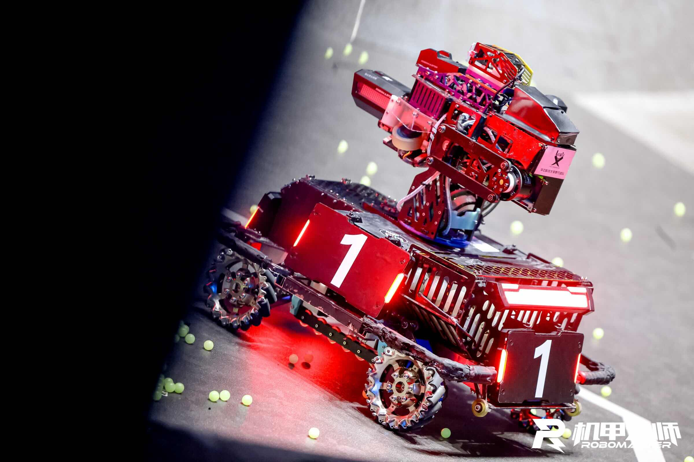
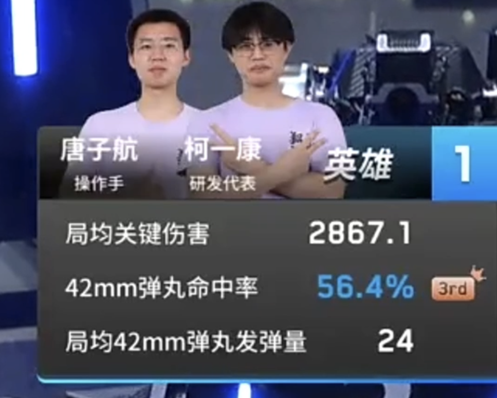

<div align="center" float="left">
<a href="https://www.robomaster.com/en-US">

</a>
&nbsp;&nbsp;&nbsp;&nbsp;&nbsp;&nbsp;&nbsp;&nbsp;&nbsp;&nbsp;
<a href="[https://www.hustlangya.fun](https://www.hustlangya.fun)">

</a>
</div>
<br>
<div align="center">
<b> Huazhong University of Science and Technology, Langya Team, Vision Group </b><br>English&nbsp;|&nbsp;<a href="/README.md">中文</a>
</div>
<br>

<i>This content is originally written in Chinese, and the English version is translated by AI. Please forgive any inaccuracies in the translation.</i>

<div align="center">
<h4>
National Competition Performance
</h4>


<h4>
Regional Competition Performance
</h4>


Full National Competition Video:
[【Immersive Auto-Aiming Outpost | Bilibili】](https://www.bilibili.com/video/BV1ubYueDEk9/)

</div>

<div align="center">
<div style="display: flex">

🏅 RoboMaster 2024 Open Source Award Excellence Award

</div>
</div>

## Features Overview 🔎

The main functionalities developed for the Hero robot's algorithm this season include Outpost striking, vehicle striking auto-aiming, and green light assisted lob shooting.

Outpost striking and vehicle striking auto-aiming both adopt the widely used delayed striking solution.

Green light assisted lob shooting combines a priori distance with the recognition of the dart guiding light on top of the base to assist with lob shooting.

## Environment Setup 🛠

### Hardware Environment 📡

| Hardware           | Model        |
| -------------- | ----------- |
| Onboard Computing Platform   | NUC11       |
| Daheng Camera Sensor | \\           |
| Lens           | 8mm Focal Length     |
| Lower-level Communication     | C-Board Virtual Serial Port |

### Software Environment 🖥

```
GCC
OpenVINO >= 2023.0
OpenCV
Eigen
Sophus
Glog 
CeresSolver
Jsoncpp
GalaxyCamera
```

*Since yolov8 and yolov10 use ops with `opset11` or greater, OpenVINO 2023.0 or later is required for compilation. Please refer to the OpenVINO [Official Documentation](https://docs.openvino.ai/2023.3/openvino_docs_ops_opset.html) for details.*

### Compilation and Execution 🚀

```shell
mkdir build
cd build
cmake ..
make -j8
./AutoAim
```

## Framework Features 📦

1.  Deployment of deep learning models using OpenVINO
2.  Logging using glog
3.  Data visualization and debugging using the UDP protocol and VOFA+ tool (Usage method can be found in the open-source repository below)
    [https://github.com/liulog/Debug\_udp\_VOFA](https://github.com/liulog/Debug_udp_VOFA)
4.  Reading configuration files using jsoncpp. All vehicle-specific parameters can be adjusted via the configuration file. All adjustable parameters are in [src/utils/tools/init.json](src/utils/tools/init.json)

## File Directory Structure 📂

```shell
.
├── armor_detector			Armor Plate Detection Module
│   ├── CMakeLists.txt
│   ├── include
│   │   ├── ArmorFinder.h
│   │   ├── Detector.h
│   │   ├── Inference.hpp
│   └── src
│       ├── ArmorFinder.cpp
│       ├── Detector.cpp	Key Function（*）
│       ├── Inference.cpp
├── AutoAim.cpp				Auto-Aim Main Program
├── AutoAim.h
├── driver					Related Driver Code (Camera, Serial Port)
├── pose_estimate			Pose Estimation Module (PnP + Fire Control)
│   ├── CMakeLists.txt
│   ├── include
│   │   ├── ExtendedKalman.hpp
│   │   ├── NormalEKF.h
│   │   ├── PoseSolver.h  Key Function（*）
│   │   ├── Predictor.h
│   │   ├── Predictor_main.h
│   └── src
│       ├── NormalEKF.cpp
│       ├── PoseSolver.cpp
│       ├── Predictor.cpp
│       └── Predictor_main.cpp
└── utils					Utility Module
```

## Key Principles Explained ♾️

### Static Target Auto-Aiming 🎯

#### Target Pose Estimation 🎯

For the Hero's auto-aiming, target pose estimation is particularly important. Firstly, we need to know the distance to the center of the target armor plate. Secondly, we need to know the orientation of the armor plate. If the armor plate's orientation is too tilted, there is a risk of it being misidentified as a small projectile. Therefore, the striking range for the large projectile needs to be judged.

Limited by this season's armor plate recognition scheme, there is some error in the feature points sampled from the armor plate light bars. With an 8mm lens, the PnP distance calculation error can reach 20%. Since the large projectile has a low muzzle velocity, its trajectory is extremely sensitive to distance. A 20% distance error can cause the gimbal to shake up and down. By introducing a mean filter, we eliminated some shaking, but for objects at greater distances, severe errors caused trajectory deviation.

#### Trajectory Equation ♾️

Assuming the projectile is flying in the air, considering air resistance and gravity, the differential equation can be expressed as:

$$
m \frac{\mathrm dv_y}{\mathrm dt} = -mg - k_1 v v_y
$$where $v_y$ is the vertical component of the velocity, $v$ is the magnitude of the velocity, $m$ is the mass, $g$ is the acceleration due to gravity, and $k_1$ is the coefficient related to air resistance.

The time of flight is given by the following formula:

$$
T = \frac{e ^ {k_1 \cdot d} - 1}{k_1 \cdot v \cdot \cos(\theta)}
$$
Where:

  - $k_1$ is a constant related to the air resistance coefficient;

  - $d$ is the horizontal distance to the target;

  - $v$ is the initial velocity of the projectile;

  - $\theta$ is the pitch angle.

The vertical displacement of the projectile is given by the following formula:

$$
\delta_z = z - \frac{v \cdot \sin(\theta) \cdot T}{\cos(\theta)} + \frac{0.5 \cdot g \cdot T ^ 2}{\cos ^ 2(\theta)}
$$Where:

- $z$ is the target's height;

- $g$ is the acceleration due to gravity;

- Other symbols are defined as above.

Finally, we use the Newton-Raphson method to solve for the pitch angle $\theta$ that satisfies the vertical motion equation, specifically:

$$
\theta_{n+1} = \theta_n - \frac{\delta_z}{f'(\theta)}
$$
Where $f'(\theta)$ is the derivative of the vertical displacement equation with respect to $\theta$.

When the target's coordinates in the world coordinate system are accurate enough, this equation can fit the flight trajectory of the 42mm projectile very well. In the trajectory equation above, the only constant is the air resistance coefficient. Experiments show that using the volume constant for a sphere yields good results. After further fine-tuning, we slightly reduced this constant, which is related to the dimples on the surface of the large projectile. In practice, under muzzle velocities of 15-16 m/s, the main error in this equation comes from the error in the distance calculation of the armor plate.

The trajectory calculation code can be found in the `solveGimbalPose` function in [src/pose\_estimate/src/PoseSolver.cpp](src/pose_estimate/src/PoseSolver.cpp).

#### Trajectory Calibration 🚀

Through the controlled variable study and experiments above, we have a quantitative understanding of the errors in pose estimation and the trajectory equation. When calibrating the Hero's trajectory, only the relative error between the camera and the gimbal firing mechanism needs to be adjusted. We introduced three dimensions of camera rotation—yaw, pitch, and roll—and a translation vector to describe the error between the firing mechanism and the camera.

$$
\boldsymbol P_g=\boldsymbol P_c\boldsymbol R_z(\phi)\boldsymbol R_y(\theta)\boldsymbol R_x(\psi)+\boldsymbol t
$$
Where:

- $\boldsymbol P_g$ is the coordinate of the armor plate target in the world coordinate system

- $\boldsymbol P_c$ is the coordinate of the armor plate target in the camera coordinate system

- $\boldsymbol R_z$, $\boldsymbol R_y$, $\boldsymbol R_x$ are the rotation matrices corresponding to yaw, pitch, and roll

- $\boldsymbol t$ is the translation vector from the center of the gimbal firing mechanism to the camera's optical center in the world coordinate system

This scheme achieves a complete overall modeling of the vehicle's firing process while retaining a visual tuning method. By only adjusting $\boldsymbol t$ and $\phi, \theta, \psi$, adjustments can be made quickly. Actual tests show that with normal camera mounting, the translation vector is only sensitive in the height direction, and the camera's rotation angles can be calibrated by visualizing the world coordinate system axes (see the commented section in the `solveArmor` function in [src/pose\_estimate/src/PoseSolver.cpp](src/pose_estimate/src/PoseSolver.cpp)). Once skilled, trajectory calibration for a Hero robot can be completed in just 10 minutes.

This calibration algorithm can be found in the `Posesolver()` constructor in [src/pose\_estimate/src/PoseSolver.cpp](src/pose_estimate/src/PoseSolver.cpp).

However, this solution also has flaws. The most serious problem is the inability to cope with the self-spin of the three-friction-wheel projectile trajectory when tilted. In practice, we found that when striking on a slope, the uneven force applied by the three friction wheels to the projectile causes significant self-spin in the fired bullet, which leads to trajectory drift in a certain direction. Furthermore, this drift increases as the tilt angle increases. This phenomenon severely affected our hit rate when striking from the slopes in the highway area and the small resource island. After discovering this problem, we temporarily introduced a parameter related to the gimbal roll angle to apply a terminal correction to the trajectory, which solved the issue. However, this terminal-based correction deviates from the original intention of overall modeling, and this correction method may cause over-correction for nearby objects.

### Green Light Assisted Lob Shooting 🟢

Whether it's an 8-meter or 25-meter lob shot, the armor plate is almost impossible to fully recognize with a single, level camera view. Even if the armor plate is successfully recognized, there will still be very large calculation errors. Therefore, we designed a scheme to recognize the green light on top of the base for assisted lob shooting. However, green light recognition is a single-point recognition, and pose estimation cannot be performed based solely on the green light. We introduced the distance and height of the lob shot point as prior knowledge, which, combined with the single-point recognition of the green light, allows for pose estimation.

### Outpost Auto-Aiming 🎯

The biggest change in outpost auto-aiming this season is the abandonment of using a prior rotational speed as a parameter for delayed striking. After analysis, the Hero robot's striking interval when hitting the outpost is only about 80 milliseconds. Exceeding this interval can lead to a hit deviation or misidentification as a small projectile. Since we cannot guarantee that the self-made outpost's rotational speed is perfectly consistent with the official outpost's rotational speed, using a prior rotational speed parameter is very likely to cause "overfitting." That is, it might hit the outpost at home but be identified as a small projectile or fail to hit during the competition. Actual testing showed that the rotational speed of the home outpost might have an error of about 5% compared to the official parameters. By checking the observational logs on the field, we found that the official outpost's rotational speed itself also has an error of about 5%. In extreme cases, the combination of the two could result in an error of over 10%, which is enough to cause the auto-aim to miss. Therefore, we designed an algorithm to decouple the outpost rotational speed. We also pleasantly discovered that this solution can also be applied to delayed striking auto-aiming for ordinary infantry robots performing a static small-whirlwind movement, achieving good results against stationary spinning Sentry robots in the league matches.

Outpost auto-aiming also depends on the Hero robot's link firing delay parameter. we designed a testing procedure to measure the firing delay and achieved a measurement accuracy of 5ms for the firing delay. Intuitively, the smoothness of the bullet chain is fully related to the firing delay. By optimizing the bullet chain structure, we achieved minimal and stable firing delay.

<table>
  <tr>
    <td> Average Firing Delay </td>
    <td>165ms</td>
  </tr>
  <tr>
    <td> Firing Delay Standard Deviation </td>
    <td>0.0127</td>
  </tr>
</table> 

The algorithm flow for the Hero robot's outpost auto-aiming this season is as follows (see the `antitop` function in [src/pose\_estimate/src/PoseSolver.cpp](src/pose_estimate/src/PoseSolver.cpp)):

1.  Fit the striking center of the outpost. We designed a queue to store the pose information of the captured outpost armor plate in each frame. When the number of armor plates in the queue exceeds a certain threshold, the armor plate farthest away or with the largest tilt angle is deleted. After a complete fan blade passes, the outpost's striking center can be calculated using the geometric average of all armor plates in the queue.
2.  Capture the rising edge signal when the outpost fan blade passes the striking area. We define all armor plates within a certain distance of the striking center as being in the striking area. Every time a fan blade passes this area, the rotational speed of the armor plate can be estimated by calculating the time difference of the rising edge of this signal.
3.  Set the delayed strike. When a fan blade passes the striking area, the required delayed striking time can be obtained by calculating the projectile's flight time combined with the firing delay and the outpost's rotational speed.

The above algorithm idea is very simple, but several issues need attention.

1.  Center Estimation: In our deep learning recognition model, the sampled points of the armor plate at specific angles may abnormally expand outwards, leading to the PnP calculated distance being shorter at that angle. This can cause a center point offset in the method of deleting the farthest armor plate described above. The solution is to use the tilt angle for auxiliary deletion judgment. (See the `antitop` function in [src/pose\_estimate/src/PoseSolver.cpp](src/pose_estimate/src/PoseSolver.cpp))
2.  Striking Area Setting: Due to the large PnP distance calculation error, the striking center may actually have a large front-to-back distance error. If we crudely design a distance range, it might lead to a situation where the armor plate passes the striking area without triggering. Mathematically, this problem is actually caused by introducing the problem's dimension into three dimensions. We finally designed a "distance function" based on the two-dimensional coordinates on the image. This distance function is extremely sensitive to horizontal changes and insensitive to vertical changes, achieving 100% triggering when the armor plate passes the striking area. (See the `antitop` function in [src/pose\_estimate/src/PoseSolver.cpp](src/pose_estimate/src/PoseSolver.cpp))
3.  Trigger Signal Debouncing: Due to the high frame rate of armor plate recognition, repeated triggering may occur at the trigger edge during the recognition process. We adopted a principle similar to hardware debouncing and designed a buffer to debounce the trigger signal. (See the `antitop` function in [src/pose\_estimate/src/PoseSolver.cpp](src/pose_estimate/src/PoseSolver.cpp))
4.  Challenges from Increased Distance: As the distance increases, the deep learning model's recognition error for the armor plate light bars also increases, the error in distance calculation increases, the error in calculating the bullet flight time increases, and the bullet trajectory scatter increases. Combining the above issues, a conclusion can be drawn: as the distance increases, the striking accuracy decreases exponentially. The actual test results are consistent with the theoretical analysis. The longest striking distance we designed at the beginning of the season was 9 meters. By optimizing the recognition model, trajectory equation, and trajectory, we ultimately achieved an 80% hit rate at 7m, meeting our design goal. (See the recognition algorithm in [src/armor\_detector/src/Detector.cpp](src/armor_detector/src/Detector.cpp))

## Algorithm Performance, Advantages, and Disadvantages Analysis 📈

### Static Target Auto-Aiming 🎯

The performance of static target auto-aiming actually depends on the performance of the trajectory equation and the accuracy of the pose estimation. Limited by the precision of feature point sampling in deep learning, the PnP distance calculation error this season can reach up to 20%, with an average of about 10%. By introducing methods such as mean filtering, the vertical shaking of the gimbal during long-distance auto-aiming was reduced to some extent. This season's static target auto-aiming achieved a **90% hit rate** under the following metrics.

| Parameter             | Value / Unit     |
| ---------------- | ----------- |
| Self-roll Tilt Degree | $(-10,+10) / °$ |
| Target Distance         | $(0,10) / \text{m}$    |
| Target Relative Height     | $(-50,50) / \text{cm}$ |

Currently, the applicable range of static target auto-aiming is still relatively short, and it cannot recognize or auto-aim objects at ultra-long distances. In addition, recognition jitter causes significant errors in pose estimation.

Next season, efforts can focus on two areas for optimization. In terms of recognition, adopt a method combining deep learning ROI with traditional vision for light bar center point sampling to improve recognition accuracy. For long-distance auto-aiming, combine it with a radar, utilizing vision stickers, to estimate the Hero robot's field pose, achieving full-field assisted aiming for structures.

### Green Light Assisted Lob Shooting 🟢

Since the lob shot point in the arena might still move within a small range during confrontation, we need to perform a sensitivity analysis on these prior parameters.

| Parameter | Sensitivity ($\text{conf}=90\%$) |
| ---- | ------------------ |
| Distance | $2\text{m}$                 |
| Height | $60\text{cm}$               |

Ultimately, this solution was not used in the actual competition because adaptation training revealed that the green lights on the emergency exits in the venue could cause misidentification. Next season, more robust recognition and pose estimation solutions should be considered.

### Outpost Auto-Aiming 🎯

The performance metric for outpost auto-aiming is the outpost hit rate. The outpost hit rate is significantly affected by distance, and the specific hit rate metrics are as follows.

On flat ground (highway area) or on a slope (left side of the small resource island):

| Distance | Hit Rate  |
| ---- | ------- |
| $3\text{m}$   | $100\%$    |
| $5\text{m}$   | $92.3\%$   |
| $7\text{m}$   | $81.5\%$   |
| $9\text{m}$   | Less than $50\%$ |

It can be clearly seen that the performance of outpost auto-aiming significantly decreases as the distance increases. Physical modeling analysis shows that the striking distance and the striking hit rate have an inverse exponential relationship. Through our continuous tuning, we finally achieved an extremely high hit rate in the core striking area, the highway area. According to statistics, the actual combat **hit rate reached 91%** (excluding misfires caused by negative bullet count and extra shots after the outpost was destroyed). The fastest time to destroy the outpost in actual combat was at **6 minutes and 28 seconds on the countdown**. The **fastest time** from positioning to destroying the outpost in actual combat was **15 seconds**. The **fastest time** from the end of fitting to destroying the outpost in actual combat was **11 seconds**. Different distances and different tilt angles were also attempted in actual combat, all achieving considerable hit rates.



## Software and Hardware System Block Diagram


## Future Optimization Directions 🚀

1.  The recognition and pose estimation solutions currently adopted by our university have a relatively large error in target distance calculation. Next season, the recognition and pose estimation solutions need to be optimized to improve the precision of target distance calculation.
2.  The current recognition solution adopted by our university has poor recognition capabilities for armor plates at extreme angles, which cannot meet the needs of near-distance and long-distance assisted lob shooting. Next season, it can be combined with the recognition of other light bars in the venue for overall recognition and pose estimation.
3.  The current outpost solution has the problem of completely discarding prior parameters, resulting in a relatively long time (5-7 seconds) required for rotational speed fitting before striking. Next season, efforts can focus on combining some prior knowledge of rotational speed to speed up the outpost rotational speed fitting. 

## Acknowledgements 🙏

Thanks to all members of the Langya Team Vision Group and Hero Group for their hard work and dedication this season.

Thanks to the TUP Team from Shenyang Aerospace University and the elders of the Langya Team Vision Group\!

## Contact Information 📇

mail: [me@micdz.cn](mailto:me@micdz.cn)

## Other 📚

This season, I developed a simple quantitative analysis tool for the Hero's trajectory. By manually marking the impact points, it can calculate a ballistic scatter score. The tool is still crude, but I hope it can provide a quantitative ballistic testing idea for other universities. The open-source link is as follows: [https://github.com/MicDZ/RM-Ballistic-Analysis](https://github.com/MicDZ/RM-Ballistic-Analysis).
